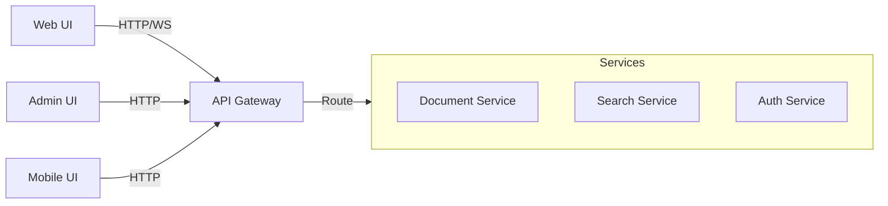
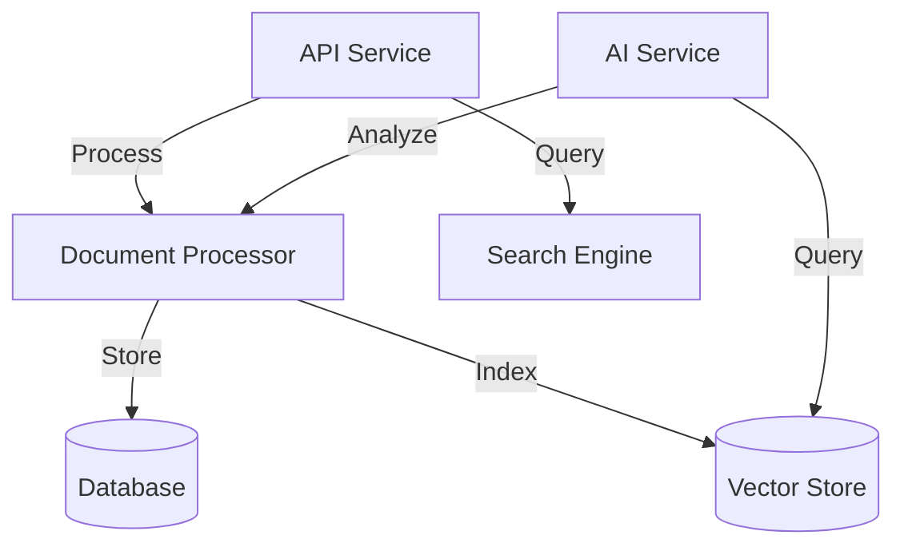

# Veda Base Documentation

## Overview

Veda Base is a modern document management and knowledge extraction system that leverages AI to help organizations organize, analyze, and retrieve information from their documents. This documentation provides comprehensive information about the system's architecture, features, development, deployment, and usage.

## Quick Links

### Getting Started

- [Quick Start Guide](./getting_started.md) - Get up and running quickly
- [Basic Concepts](./concepts/basic_concepts.md) - Understanding core concepts
- [System Requirements](./deployment/requirements.md) - Hardware and software requirements

### User Guides

- [User Manual](./user_guides/user_manual.md) - Complete user guide
- [Document Management](./user_guides/document_management.md) - Working with documents
- [Search Guide](./user_guides/search_guide.md) - Effective search strategies
- [Knowledge Graph](./user_guides/knowledge_graph.md) - Understanding and using the knowledge graph

### Architecture

- [System Architecture](./architecture/overview.md) - High-level system architecture
- [AI/ML Architecture](./architecture/ai_ml_architecture.md) - AI and ML system design
- [Data Flow](./architecture/data_flow.md) - System data flow diagrams
- [Security Architecture](./architecture/security.md) - Security design and implementation

### Development

- [Development Guide](./development/development_guide.md) - Setting up development environment
- [API Reference](./api/api_reference.md) - Complete API documentation
- [Contributing Guidelines](./development/contributing.md) - How to contribute
- [Code Style Guide](./development/code_style.md) - Coding standards and practices

### Deployment

- [Deployment Guide](./deployment/deployment_guide.md) - Production deployment instructions
- [Configuration](./deployment/configuration.md) - System configuration options
- [Monitoring](./deployment/monitoring.md) - Monitoring and alerting setup
- [Backup & Recovery](./deployment/backup_recovery.md) - Data backup and recovery procedures

### Features

#### Document Processing

- [Supported Formats](./features/supported_formats.md) - Document format support
- [OCR Capabilities](./features/ocr.md) - Optical character recognition
- [Metadata Extraction](./features/metadata.md) - Automatic metadata extraction
- [Content Analysis](./features/content_analysis.md) - Content analysis features

#### Search & Retrieval

- [Search Features](./features/search.md) - Search capabilities
- [Query Language](./features/query_language.md) - Advanced query syntax
- [Ranking & Relevance](./features/ranking.md) - Result ranking algorithms
- [Faceted Search](./features/faceted_search.md) - Filter and facet capabilities

#### AI & ML Features

- [Multi-Agent System](./features/multi_agent_system.md) - AI agent architecture
- [Knowledge Extraction](./features/knowledge_extraction.md) - Information extraction
- [Entity Recognition](./features/entity_recognition.md) - Named entity recognition
- [Relationship Detection](./features/relationships.md) - Entity relationship detection

#### Integration

- [API Integration](./integration/api_integration.md) - API integration guide
- [Authentication](./integration/authentication.md) - Authentication methods
- [Webhooks](./integration/webhooks.md) - Event webhooks
- [Client Libraries](./integration/client_libraries.md) - Available client libraries

## System Components

### Frontend

### Backend

## Technology Stack

### Core Technologies

- **Backend**: Python 3.8+, FastAPI
- **Frontend**: Next.js 14, React 18
- **Database**: PostgreSQL 14
- **Cache**: Redis 7
- **Search**: ChromaDB
- **AI**: Groq LLM

### Infrastructure

- **Container Runtime**: Docker
- **Orchestration**: Kubernetes
- **CI/CD**: GitHub Actions
- **Monitoring**: Prometheus, Grafana
- **Logging**: Logfire

## Getting Help

### Support Channels

- [GitHub Issues](https://github.com/yourusername/veda-base/issues) - Bug reports and feature requests
- [Community Forum](https://forum.vedabase.com) - Community discussions
- [Stack Overflow](https://stackoverflow.com/questions/tagged/veda-base) - Technical Q&A
- [Discord](https://discord.gg/vedabase) - Real-time community chat

### Contributing

- [How to Contribute](./development/contributing.md)
- [Development Setup](./development/development_guide.md)
- [Code of Conduct](./development/code_of_conduct.md)
- [Security Policy](./security/security_policy.md)

### Troubleshooting

- [Common Issues](./troubleshooting/common_issues.md)
- [FAQ](./troubleshooting/faq.md)
- [Debug Guide](./troubleshooting/debug_guide.md)
- [Error Codes](./troubleshooting/error_codes.md)

## Release Information

### Version History

- [Changelog](./releases/changelog.md)
- [Migration Guides](./releases/migration_guides.md)
- [Roadmap](./releases/roadmap.md)
- [Known Issues](./releases/known_issues.md)

### License

This project is licensed under the [MIT License](../LICENSE).

## Additional Resources

### Examples & Tutorials

- [Code Examples](./examples/README.md)
- [Tutorials](./tutorials/README.md)
- [Best Practices](./guides/best_practices.md)
- [Use Cases](./guides/use_cases.md)

### Reference

- [Glossary](./reference/glossary.md)
- [API Endpoints](./reference/api_endpoints.md)
- [Configuration Options](./reference/configuration.md)
- [Environment Variables](./reference/environment_variables.md)

## Documentation Updates

This documentation is continuously updated. For the latest version, please visit our [GitHub repository](https://github.com/yourusername/veda-base).
