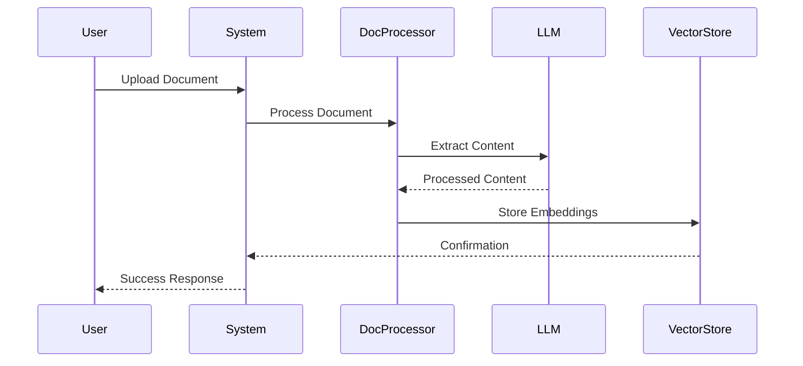
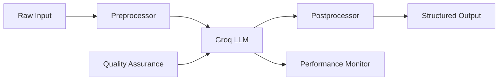
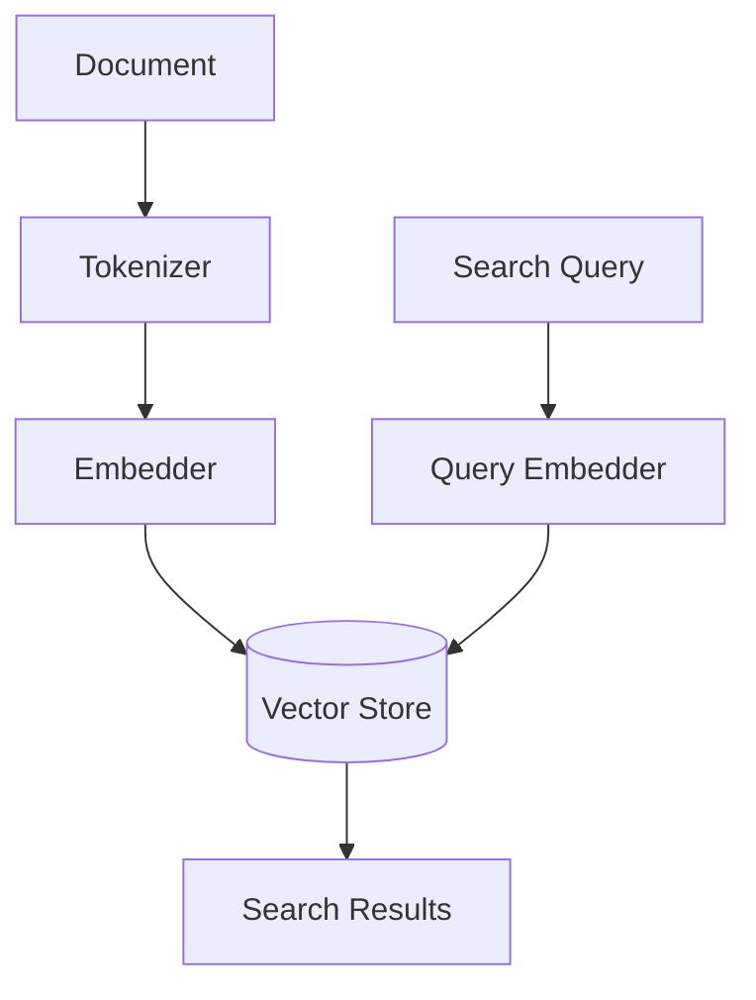

# AI/ML Architecture

## Overview

Veda Base leverages advanced AI/ML capabilities through a multi-agent system architecture. The system integrates large language models, vector embeddings, and specialized AI agents to provide intelligent document processing, knowledge extraction, and information retrieval services.

## AI Agent System

### Agent Architecture

```mermaid
graph TD
    %% Agent System Components
    subgraph Agent System
        LP[Librarian Prime] --> |Orchestrates| Agents
        
        subgraph Agents
            CC[Content Curator]
            TM[Taxonomy Master]
            CW[Connection Weaver]
            AS[Analytics Sage]
        end
        
        subgraph Services
            DP[Document Processor]
            KG[Knowledge Graph]
            VS[Vector Store]
        end
        
        %% Agent Interactions
        CC --> |Processes| DP
        TM --> |Manages| KG
        CW --> |Analyzes| VS
        AS --> |Monitors| Services
    end
    
    %% External Systems
    LLM[Groq LLM] --> Agent System
    DB[(ChromaDB)] --> VS
```

### Agent Roles

#### Librarian Prime

- System orchestration
- Task delegation
- Resource allocation
- Performance optimization

#### Content Curator

- Document analysis
- Content classification
- Quality assessment
- Metadata enrichment

#### Taxonomy Master

- Knowledge organization
- Category management
- Relationship mapping
- Ontology maintenance

#### Connection Weaver

- Pattern recognition
- Cross-referencing
- Similarity analysis
- Knowledge synthesis

#### Analytics Sage

- Performance monitoring
- Usage analytics
- Trend analysis
- Insight generation

## AI/ML Pipeline

### Document Processing Pipeline



### Knowledge Extraction

#### Text Processing

- Named entity recognition
- Key phrase extraction
- Topic modeling
- Sentiment analysis

#### Content Understanding

- Context analysis
- Reference extraction
- Citation linking
- Fact verification

#### Semantic Analysis

- Meaning extraction
- Relationship identification
- Concept mapping
- Knowledge graph population

## Model Integration

### Language Models

#### Groq Integration

- API configuration
- Model selection
- Parameter optimization
- Response handling

#### Model Pipeline



### Vector Embeddings

#### ChromaDB Integration

- Document embeddings
- Similarity search
- Clustering
- Dimensionality reduction

#### Embedding Pipeline



## MLOps Infrastructure

### Model Management

- Version control
- Deployment automation
- Performance monitoring
- A/B testing

### Data Pipeline

- Data ingestion
- Preprocessing
- Feature extraction
- Quality validation

### Monitoring & Metrics

- Model performance
- Resource utilization
- Error tracking
- Quality metrics

## Performance Optimization

### Caching Strategy

- Result caching
- Embedding cache
- Feature store
- Query optimization

### Scaling Considerations

- Load balancing
- Resource allocation
- Batch processing
- Parallel execution

## Security & Privacy

### Data Protection

- Input sanitization
- Output validation
- PII detection
- Data encryption

### Access Control

- Model access
- API authentication
- Usage quotas
- Audit logging

## Future Enhancements

### Planned Improvements

- Multi-model support
- Advanced reasoning
- Automated optimization
- Enhanced privacy

### Research Areas

- Few-shot learning
- Transfer learning
- Active learning
- Continual learning
