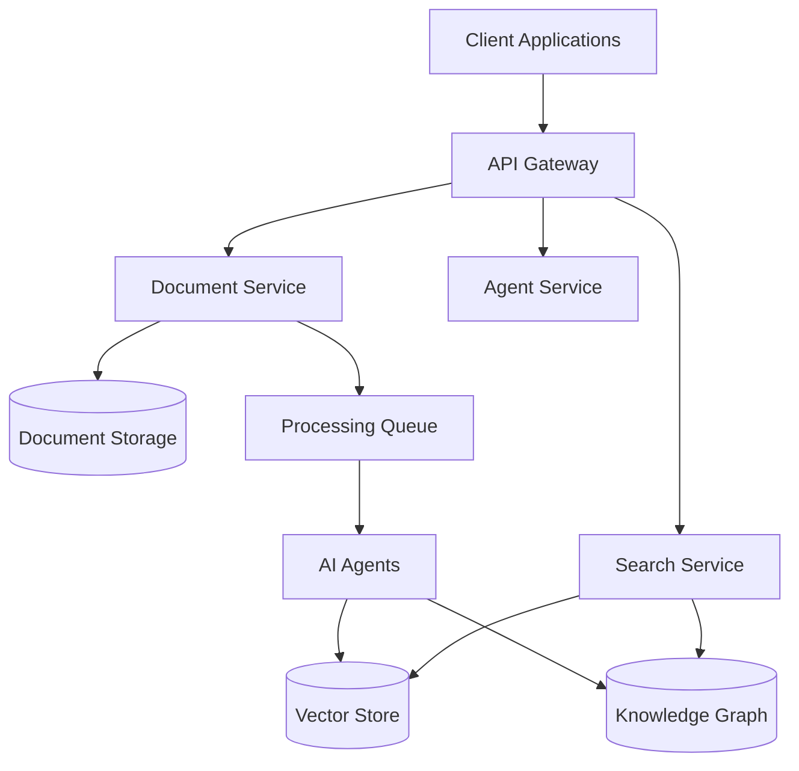
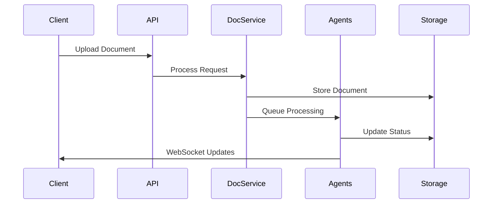
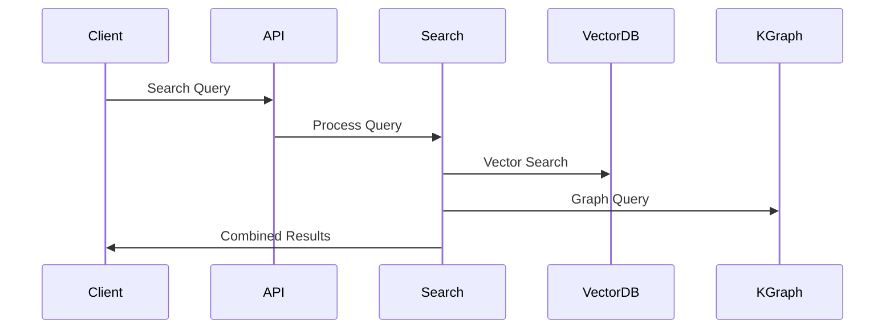
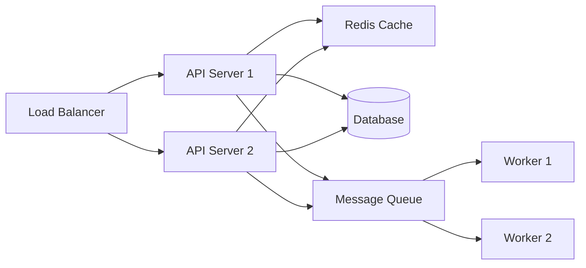

# Architecture Overview

## System Architecture

Veda Base is built on a modern, scalable architecture that combines powerful AI capabilities with efficient document processing. The system is designed to be modular, maintainable, and extensible.

## Core Components

### Frontend Layer

- **Next.js Application**: Modern React-based web interface
- **WebSocket Client**: Real-time processing updates
- **React Query**: State management and API integration
- **TailwindCSS**: Responsive UI styling

### API Layer

- **FastAPI Backend**: High-performance API server
- **WebSocket Server**: Real-time communication
- **Authentication**: API key and session management
- **Rate Limiting**: Request throttling and protection

### Document Processing

- **Document Service**: Handles document upload and processing
- **Format Handlers**: PDF, Markdown, HTML processors
- **Processing Queue**: Asynchronous task management
- **Status Tracking**: Real-time progress monitoring

### AI System

- **Multi-Agent Architecture**: Specialized AI agents
- **Document Processor Agent**: Content extraction and analysis
- **Knowledge Graph Agent**: Relationship mapping
- **Taxonomy Agent**: Content classification

### Storage Layer

- **Document Store**: Raw document storage
- **Vector Database**: Semantic search capabilities
- **Knowledge Graph**: Entity relationships
- **Cache Layer**: Performance optimization

## Data Flow

### Document Processing Flow

### Search Flow

## Security Architecture

### Authentication & Authorization

- API key validation
- Role-based access control
- Request signing
- Session management

### Data Protection

- TLS encryption
- Data encryption at rest
- Secure file handling
- Input validation

## Scalability

### Horizontal Scaling

- Stateless API servers
- Distributed processing
- Load balancing
- Service discovery

### Performance Optimization

- Caching strategy
- Connection pooling
- Batch processing
- Resource optimization

## Monitoring & Logging

### System Monitoring

- Performance metrics
- Resource utilization
- Error tracking
- Health checks

### Application Logging

- Structured logging
- Log aggregation
- Audit trails
- Debug information

## Deployment Architecture

### Container Architecture

### Infrastructure Components

- Kubernetes cluster
- Container registry
- Load balancers
- Message brokers
- Monitoring stack

## Error Handling

### Failure Modes

- Network failures
- Service unavailability
- Resource exhaustion
- Data corruption

### Recovery Procedures

- Automatic retries
- Circuit breakers
- Fallback mechanisms
- Data consistency checks

## Future Extensibility

### Integration Points

- External API hooks
- Plugin system
- Custom processors
- Extension modules

### Planned Enhancements

- Advanced AI models
- Real-time collaboration
- Enhanced visualization
- Additional formats
