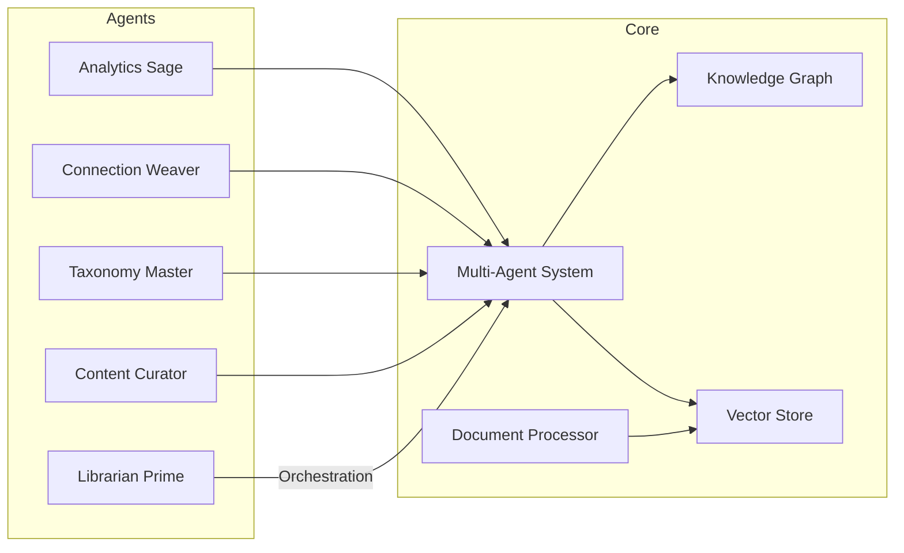
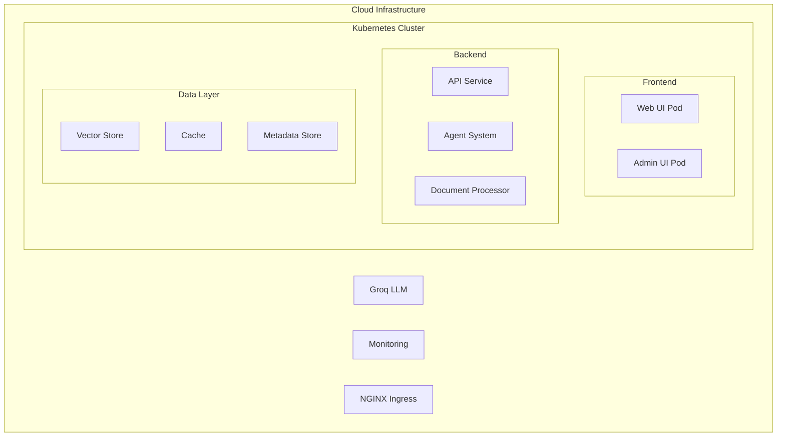

# System Architecture Overview

## Introduction

Veda Base is built on a modern, scalable architecture designed to handle large-scale document processing and knowledge management. The system uses a multi-agent approach combined with advanced AI capabilities to provide intelligent document processing, knowledge extraction, and information retrieval.

## System Components

### Frontend Layer

- **Web UI (Next.js)**
  - Modern React-based interface
  - Real-time updates via WebSocket
  - Responsive design for all devices
  - Client-side state management

- **Admin Interface (Streamlit)**
  - System monitoring and management
  - Performance analytics
  - Configuration management
  - Debugging tools

### API Layer

- **FastAPI Server**
  - RESTful API endpoints
  - WebSocket support
  - Request validation
  - Authentication/Authorization
  - Rate limiting

### Core Services

### Data Layer

- **Vector Store (ChromaDB)**
  - Document embeddings
  - Semantic search
  - Similarity matching
  - Clustering capabilities

- **Knowledge Graph**
  - Entity relationships
  - Semantic connections
  - Cross-references
  - Graph analytics

- **Cache Layer (Redis)**
  - Query caching
  - Session management
  - Real-time data
  - Feature store

## Communication Patterns

### Event-Driven Architecture

- Message-based communication between components
- Asynchronous processing
- Event sourcing for state management
- Command-query responsibility segregation (CQRS)

### Real-time Updates

- WebSocket connections for live updates
- Server-sent events for notifications
- Progress tracking
- Status broadcasting

## Scalability

### Horizontal Scaling

- Kubernetes-based container orchestration
- Microservices architecture
- Load balancing
- Auto-scaling capabilities

### Data Scaling

- Database sharding
- Distributed caching
- Partitioned storage
- Replication strategies

## Security Architecture

### Authentication & Authorization

- Role-based access control (RBAC)
- JWT-based authentication
- OAuth2 integration
- API key management

### Data Protection

- Encryption at rest
- Secure communication
- Data privacy controls
- Audit logging

## Monitoring & Observability

### System Metrics

- Performance monitoring
- Resource utilization
- Error tracking
- Usage analytics

### Application Insights

- User behavior analytics
- Performance profiling
- Error reporting
- Health checks

## Deployment Architecture

### Infrastructure

### Service Dependencies

- Groq LLM API for text processing
- ChromaDB for vector storage
- Redis for caching
- PostgreSQL for metadata
- Logfire for monitoring

## Failure Handling

### Error Recovery

- Automatic retries
- Circuit breakers
- Fallback mechanisms
- Dead letter queues

### Data Resilience

- Backup strategies
- Data replication
- Disaster recovery
- State recovery

## Performance Considerations

### Optimization Points

- Query optimization
- Caching strategies
- Resource pooling
- Batch processing

### Performance Targets

- API response time: < 200ms
- Document processing: < 30s
- Search latency: < 500ms
- System uptime: 99.9%

## Future Extensibility

### Integration Points

- Plugin system
- API extensibility
- Custom agent integration
- External service connectors

### Planned Enhancements

- Edge computing support
- Advanced AI capabilities
- Mobile optimization
- Real-time collaboration
