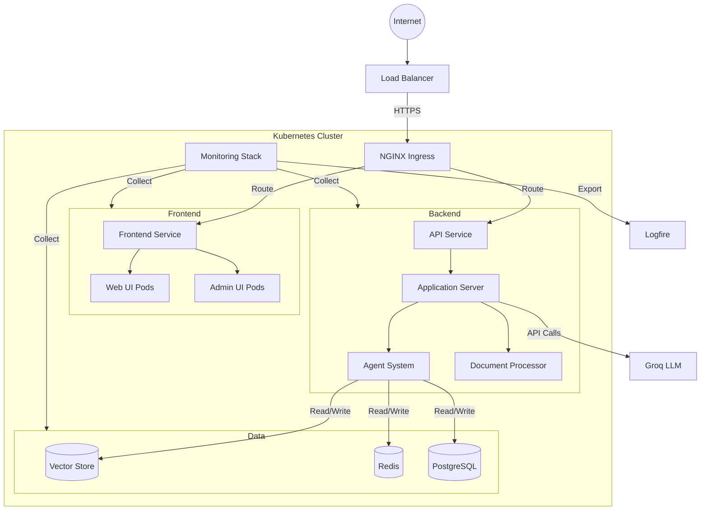

# Deployment Guide

## Overview

This guide details the deployment process for the Veda Base system. The application is containerized and designed to run on Kubernetes, with support for both cloud and on-premises deployments.

## Prerequisites

### Infrastructure Requirements

- Kubernetes cluster (v1.24+)
- Helm (v3.8+)
- Container registry access
- Load balancer
- SSL certificates

### Resource Requirements

```yaml
Minimum Cluster Specifications:
- Control Plane: 2 nodes
- Worker Nodes: 3 nodes
- CPU per node: 4 cores
- Memory per node: 16GB
- Storage: 100GB SSD per node
```

## Architecture Overview

### Component Architecture



## Deployment Process

### 1. Environment Setup

#### Create Configuration Files

```bash
# Create namespace
kubectl create namespace vedabase

# Create secrets
kubectl create secret generic vedabase-secrets \
    --from-file=./secrets/api-keys.yaml \
    --from-file=./secrets/certificates.yaml \
    --namespace vedabase

# Create configmaps
kubectl create configmap vedabase-config \
    --from-file=./config/app-config.yaml \
    --namespace vedabase
```

#### Configure Storage

```yaml
# storage-class.yaml
apiVersion: storage.k8s.io/v1
kind: StorageClass
metadata:
  name: vedabase-storage
provisioner: kubernetes.io/aws-ebs
parameters:
  type: gp3
  iopsPerGB: "3000"
  encrypted: "true"
```

### 2. Database Setup

#### Deploy PostgreSQL

```bash
# Add Helm repository
helm repo add bitnami https://charts.bitnami.com/bitnami

# Install PostgreSQL
helm install vedabase-db bitnami/postgresql \
    --namespace vedabase \
    --values ./values/postgresql-values.yaml
```

#### Deploy Redis

```bash
# Install Redis
helm install vedabase-cache bitnami/redis \
    --namespace vedabase \
    --values ./values/redis-values.yaml
```

### 3. Core Components

#### Deploy Vector Store

```bash
# Install ChromaDB
helm install alexandria-vectorstore ./helm/chromadb \
    --namespace vedabase \
    --values ./values/chromadb-values.yaml
```

#### Deploy Application Server

```yaml
# application-deployment.yaml
apiVersion: apps/v1
kind: Deployment
metadata:
  name: vedabase-api
  namespace: vedabase
spec:
  replicas: 3
  template:
    spec:
      containers:
        - name: api-server
          image: alexandria/api-server:latest
          resources:
            requests:
              cpu: "1"
              memory: "2Gi"
            limits:
              cpu: "2"
              memory: "4Gi"
```

### 4. Frontend Deployment

#### Deploy Web UI

```yaml
# web-ui-deployment.yaml
apiVersion: apps/v1
kind: Deployment
metadata:
  name: vedabase-web
  namespace: vedabase
spec:
  replicas: 2
  template:
    spec:
      containers:
        - name: web-ui
          image: alexandria/web-ui:latest
          resources:
            requests:
              cpu: "500m"
              memory: "1Gi"
            limits:
              cpu: "1"
              memory: "2Gi"
```

### 5. Monitoring Setup

#### Deploy Monitoring Stack

```bash
# Add Helm repository
helm repo add prometheus-community https://prometheus-community.github.io/helm-charts

# Install monitoring stack
helm install vedabase-monitoring prometheus-community/kube-prometheus-stack \
    --namespace vedabase \
    --values ./values/monitoring-values.yaml
```

## Configuration

### Environment Variables

```yaml
# Application Configuration
APP_ENV: production
LOG_LEVEL: info
API_VERSION: v1
ENABLE_METRICS: true

# Service Endpoints
API_URL: https://api.vedabase.com
WEB_URL: https://vedabase.com
ADMIN_URL: https://admin.vedabase.com

# External Services
GROQ_API_KEY: ${GROQ_API_KEY}
LOGFIRE_TOKEN: ${LOGFIRE_TOKEN}

# Database Configuration
POSTGRES_HOST: vedabase-db
POSTGRES_PORT: 5432
POSTGRES_DB: vedabase
POSTGRES_USER: ${POSTGRES_USER}
POSTGRES_PASSWORD: ${POSTGRES_PASSWORD}

# Cache Configuration
REDIS_HOST: vedabase-cache
REDIS_PORT: 6379
REDIS_PASSWORD: ${REDIS_PASSWORD}
```

## Security

### Network Policies

```yaml
# network-policy.yaml
apiVersion: networking.k8s.io/v1
kind: NetworkPolicy
metadata:
  name: vedabase-network-policy
  namespace: vedabase
spec:
  podSelector: {}
  policyTypes:
    - Ingress
    - Egress
  ingress:
    - from:
        - namespaceSelector:
            matchLabels:
              name: vedabase
  egress:
    - to:
        - namespaceSelector:
            matchLabels:
              name: vedabase
```

### SSL Configuration

```yaml
# ingress-tls.yaml
apiVersion: networking.k8s.io/v1
kind: Ingress
metadata:
  name: vedabase-ingress
  namespace: vedabase
  annotations:
    cert-manager.io/cluster-issuer: letsencrypt-prod
spec:
  tls:
    - hosts:
        - vedabase.com
        - api.vedabase.com
      secretName: vedabase-tls
```

## Monitoring

### Metrics Collection

```yaml
# prometheus-rules.yaml
apiVersion: monitoring.coreos.com/v1
kind: PrometheusRule
metadata:
  name: vedabase-alerts
  namespace: vedabase
spec:
  groups:
    - name: vedabase
      rules:
        - alert: HighErrorRate
          expr: rate(http_requests_total{status=~"5.."}[5m]) > 0.1
          for: 5m
          labels:
            severity: critical
```

### Logging Configuration

```yaml
# logfire-config.yaml
apiVersion: v1
kind: ConfigMap
metadata:
  name: logfire-config
  namespace: vedabase
data:
  logfire.yaml: |
    exporters:
      logfire:
        endpoint: logs.logfire.sh
        token: ${LOGFIRE_TOKEN}
```

## Scaling

### Horizontal Pod Autoscaling

```yaml
# hpa.yaml
apiVersion: autoscaling/v2
kind: HorizontalPodAutoscaler
metadata:
  name: vedabase-api-hpa
  namespace: vedabase
spec:
  scaleTargetRef:
    apiVersion: apps/v1
    kind: Deployment
    name: vedabase-api
  minReplicas: 3
  maxReplicas: 10
  metrics:
    - type: Resource
      resource:
        name: cpu
        target:
          type: Utilization
          averageUtilization: 70
```

## Backup & Recovery

### Backup Configuration

```yaml
# backup-cronjob.yaml
apiVersion: batch/v1
kind: CronJob
metadata:
  name: vedabase-backup
  namespace: vedabase
spec:
  schedule: "0 2 * * *"
  jobTemplate:
    spec:
      template:
        spec:
          containers:
            - name: backup
              image: alexandria/backup:latest
              env:
                - name: BACKUP_PATH
                  value: /backups
```

## Troubleshooting

### Common Issues

1. Pod Startup Failures

   ```bash
   kubectl describe pod <pod-name> -n vedabase
   kubectl logs <pod-name> -n vedabase
   ```

2. Database Connection Issues

   ```bash
   kubectl exec -it vedabase-db-0 -n vedabase -- psql -U postgres
   ```

3. Cache Connection Issues

   ```bash
   kubectl exec -it vedabase-cache-0 -n vedabase -- redis-cli
   ```

### Health Checks

```bash
# Check pod status
kubectl get pods -n vedabase

# Check service status
kubectl get services -n vedabase

# Check ingress status
kubectl get ingress -n vedabase

# Check persistent volumes
kubectl get pv,pvc -n vedabase
```

## Maintenance

### Rolling Updates

```bash
# Update deployment
kubectl set image deployment/vedabase-api \
    api-server=alexandria/api-server:new-version \
    -n vedabase

# Monitor rollout
kubectl rollout status deployment/vedabase-api -n vedabase

# Rollback if needed
kubectl rollout undo deployment/vedabase-api -n vedabase
```

### Cleanup

```bash
# Delete namespace and all resources
kubectl delete namespace vedabase

# Delete persistent volumes
kubectl delete pv -l app=vedabase
```
